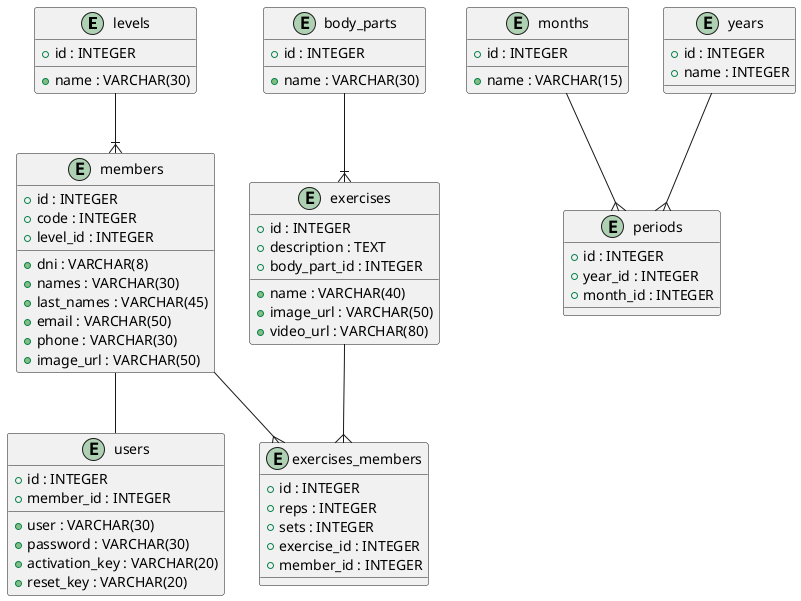

## Base de Datos

Instalar y activar el ambiente virtual - Linux:

    $ sudo apt install python3-virtualenv python3-venv
    $ python3 -m venv ./env
    $ source env/bin/activate

Instalar y activar el ambiente virtual - Windows:

    > pip install virtualenv
    > virtualenv env
    > env\Scripts\activate.bat

Arrancar aplicación:

    $ cd <<carpeta-proyecto>>
    $ pip install -r requirements.txt
    $ mkdir static/uploads
    $ python main.py

## Migraciones

Archivo <b>.env</b>

    DB=sqlite:db/app.db
    SQALCHEMY_CONNECTION_STRING=sqlite:///db/app.db
    ENV=local||replit
    OPENAI_API_KEY=xyz
    EMAIL_SENDER=correo@correo.com
    EMAIL_PASSWORD=123

Migraciones con DBMATE - app:

    $ dbmate -d "db/migrations" -e "DB" new <<nombre_de_migracion>>
    $ dbmate -d "db/migrations" -e "DB" up
    $ dbmate -d "db/migrations" -e "DB" rollback

Backup SQLite

    $ sqlite3 app.db .dump > dbname.bak

Ejecutar la aplicación con Gunicorn:

    $ gunicorn app:APP -w 6 -b 0.0.0.0:5000 --reload

MongoDB:

    $ sudo chown -R mongodb:mongodb /var/lib/mongodb
    $ sudo chown mongodb:mongodb /tmp/mongodb-27017.sock
    $ sudo chown -R mongodb:mongodb /var/log/mongodb
    $ sudo systemctl start mongod
    $ sudo ss -pnltu | grep 27017
    $ mongosh

Consultas MongoDB:

Fetch all a un resumen de todas las conversaciones de un usuario por usuario_id:

```javascript
db.conversations.aggregate([
  {
    "$match": {
      "user_id": ObjectId(usuario_id) // Reemplaza con el ObjectId que deseas filtrar
    }
  },
  {
    $lookup: {
      from: "messages", // Nombre de la colección de destino
      localField: "messages", // Campo en la colección de `conversations`
      foreignField: "_id", // Campo en la colección de `messages`
      as: "message_details" // Nombre del campo de salida que contendrá los documentos unidos
    }
  },
  {
    "$project": {
      "_id": { "$toString": "$_id" },
      "name": 1,
      "created_at": 1,
      "updated_at": 1,
      "message_count": { $size: "$message_details" }
    }
  }]);
```

Fetch a una conversación:

```javascript
db.conversations.aggregate([
  {
    "$match": {
      "_id": ObjectId("conversation_id")  // Reemplaza "conversation_id" con el valor real
    }
  },
  {
    "$lookup": {
      "from": "messages",  // Nombre de la colección de destino
      "localField": "messages",  // Campo en la colección de `conversations`
      "foreignField": "_id",  // Campo en la colección de `messages`
      "as": "message_details"  // Nombre del campo de salida
    }
  },
  {
    "$unwind": {
      "path": "$message_details",
      "preserveNullAndEmptyArrays": true  // Asegura que se conserven los documentos aunque no haya mensajes
    }
  },
  {
    "$replaceRoot": { "newRoot": "$message_details" }  // Reemplaza el documento raíz
  },
  {
    "$project": {
      "_id": 0,
      "_id": { "$toString": "$_id" },
      "question": 1,
      "answer": {
        "columns": "$answer.columns",
        "result_set": "$answer.result_set",
        "query": "$answer.query",
        "_id": { "$toString": "$answer._id" }
      },
      "error": "$error",
      "created_at": {
        "$dateToString": {
          "format": "%d/%m/%Y %H:%M:%S",
          "date": "$created_at"
        }
      }
    }
  }
]);
```

Diagrama de Base de Datos Relacional



Preguntas de ejemplo:

+ lista de miembros
+ nombres de ejercisios y cantidad de ejercicios asignados a cuantos miembros agrupados por ejercicio

---

Fuentes:

+ https://chat.openai.com/c/605a221a-87d7-4798-8783-37ecd465e384
+ https://github.com/sulmanweb/openai_chatgpt
+ https://www.cherryservers.com/blog/install-mongodb-ubuntu-22-04
+ https://regex101.com/r/rbf4KT/1