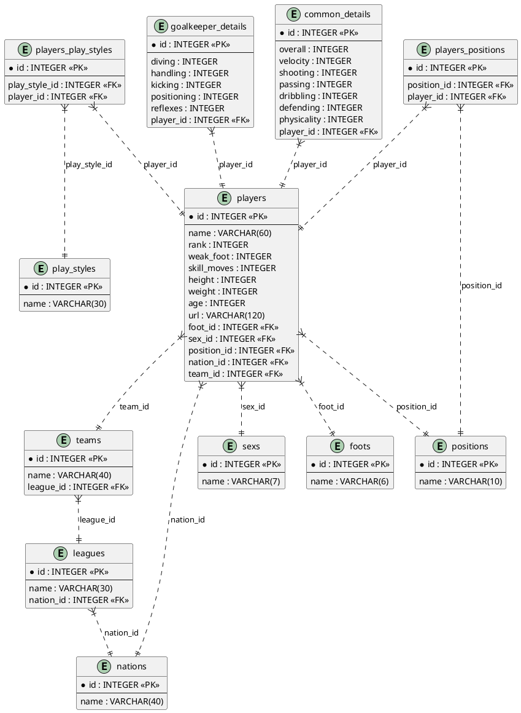

## Base de Datos

Instalar y activar el ambiente virtual - Linux:

    $ sudo apt install python3-virtualenv python3-venv
    $ python3 -m venv ./env
    $ source env/bin/activate

Instalar y activar el ambiente virtual - Windows:

    > pip install virtualenv
    > virtualenv env
    > env\Scripts\activate.bat

Arrancar aplicación:

    $ cd <<carpeta-proyecto>>
    $ pip install -r requirements.txt
    $ mkdir static/uploads
    $ python main.py

## Migraciones

Archivo <b>.env</b>

    DB=sqlite:db/app.db
    SQALCHEMY_CONNECTION_STRING=sqlite:///db/app.db
    ENV=local||replit
    OPENAI_API_KEY=xyz
    EMAIL_SENDER=correo@correo.com
    EMAIL_PASSWORD=123

Migraciones con DBMATE - app:

    $ dbmate -d "db/migrations" -e "DB" new <<nombre_de_migracion>>
    $ dbmate -d "db/migrations" -e "DB" up
    $ dbmate -d "db/migrations" -e "DB" rollback

Migraciones con DBMATE - app2:

    $ dbmate -d "db/migrations" -e "DB2" new <<nombre_de_migracion>>
    $ dbmate -d "db/migrations" -e "DB2" up
    $ dbmate -d "db/migrations" -e "DB2" rollback

Backup SQLite

    $ sqlite3 app.db .dump > dbname.bak

Ejecutar la aplicación con Gunicorn:

    $ gunicorn app:APP -w 6 -b 0.0.0.0:5000 --reload

MongoDB:

    $ sudo chown -R mongodb:mongodb /var/lib/mongodb
    $ sudo chown mongodb:mongodb /tmp/mongodb-27017.sock
    $ sudo chown -R mongodb:mongodb /var/log/mongodb
    $ sudo systemctl start mongod
    $ sudo ss -pnltu | grep 27017
    $ mongosh

Consultas MongoDB:

Fetch all a un resumen de todas las conversaciones de un usuario por usuario_id:

```javascript
db.conversations.aggregate([
  {
    "$match": {
      "user_id": ObjectId(usuario_id) // Reemplaza con el ObjectId que deseas filtrar
    }
  },
  {
    $lookup: {
      from: "messages", // Nombre de la colección de destino
      localField: "messages", // Campo en la colección de `conversations`
      foreignField: "_id", // Campo en la colección de `messages`
      as: "message_details" // Nombre del campo de salida que contendrá los documentos unidos
    }
  },
  {
    "$project": {
      "_id": { "$toString": "$_id" },
      "name": 1,
      "created_at": 1,
      "updated_at": 1,
      "message_count": { $size: "$message_details" }
    }
  }]);
```

Fetch a una conversación:

```javascript
db.conversations.aggregate([
  {
    "$match": {
      "_id": ObjectId("67086aa7fecae0b7e7381844")
    }
  },
  {
    "$lookup": {
      "from": "messages",
      "localField": "messages",
      "foreignField": "_id",
      "as": "message_details"
    }
  },
  {
    "$unwind": {
      "path": "$message_details",
      "preserveNullAndEmptyArrays": true
    }
  },
  {
    "$group": {
      "_id": {
        "conversation_id": "$_id",
        "name": "$name",
        "created_at": {
          "$dateToString": {
            "format": "%d/%m/%Y %H:%M:%S",
            "date": "$created_at"
          }
        },
        "updated_at": {
          "$dateToString": {
            "format": "%d/%m/%Y %H:%M:%S",
            "date": "$updated_at"
          }
        }
      },
      "messages": {
        "$push": {
          "answer": {
            "columns": "$message_details.answer.columns",
            "result_set": "$message_details.answer.result_set",
            "query": "$message_details.answer.query",
            "_id": { "$toString": "$message_details.answer._id" }
          },
          "error": "$message_details.error",
          "question": "$message_details.question",
          "created_at": {
            "$dateToString": {
              "format": "%d/%m/%Y %H:%M:%S",
              "date": "$message_details.created_at"
            }
          }
        }
      }
    }
  },
  {
    "$project": {
      "_id": 0,
      "id": { "$toString": "$_id.conversation_id"},  // Renombramos a `id`
      "name": "$_id.name",
      "created_at": "$_id.created_at",
      "updated_at": "$_id.updated_at",
      "messages": 1
    }
  },
  {
    "$limit": 1
  }
]);
```

Diagrama de Base de Datos Relacional



Diagrama de Secuencia al realizar preguntas.

```plantuml
@startuml
@startuml
actor Usuario
participant "SvelteApp" as FR
participant "Python Flask" as BE
participant "SQLite DB" as DB1
participant "Mongo DB" as DB2
actor "OpenAI" as OAI

Usuario -> FR : Escribe pregunta
activate FR
Usuario -> FR : Envía pregunta en \n Lenguaje Natural (LN)
FR -> BE : Pregunta LN
activate BE

group Crear Contexto del Prompt
  BE -> BE : Lee schema.sql
  BE -> BE : Lee inserts.sql
  BE -> BE : Junta pregunta con la \n información de los sql
end

BE -> OAI : Contexto + Pregunta LN

activate OAI  
  OAI -> BE : Consulta SQL
deactivate OAI

activate DB1  
  BE -> DB1 : Ejecutar consulta SQL
  DB1 -> BE : Result Set (RS)
deactivate DB1

activate DB2
  BE -> DB2: Grabar consulta + RS
  DB2 -> BE : ObjetcId
deactivate DB2

BE -> BE : Genera response

BE --> FR : Devuelve respuesta
deactivate BE
FR --> Usuario : Muestra respuesta
deactivate FR

@enduml

Preguntas de ejemplo:

+ lista de miembros
+ nombres de ejercisios y cantidad de ejercicios asignados a cuantos miembros agrupados por ejercicio

---

Fuentes:

+ https://chat.openai.com/c/605a221a-87d7-4798-8783-37ecd465e384
+ https://github.com/sulmanweb/openai_chatgpt
+ https://www.cherryservers.com/blog/install-mongodb-ubuntu-22-04
+ https://regex101.com/r/rbf4KT/1