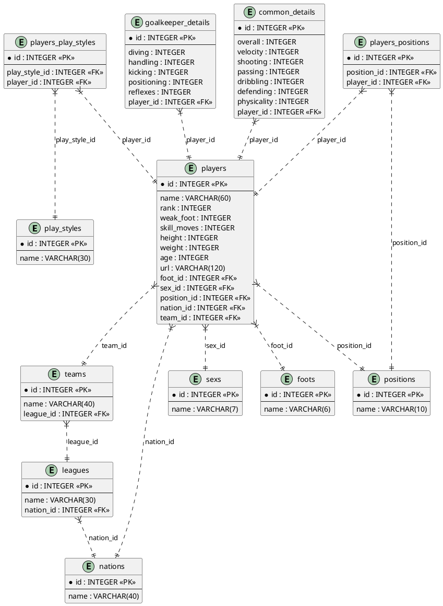
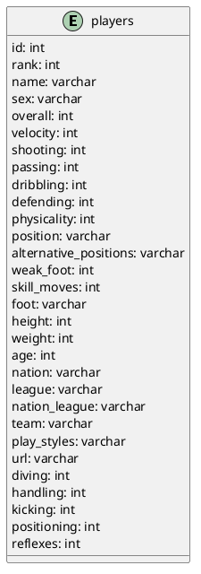
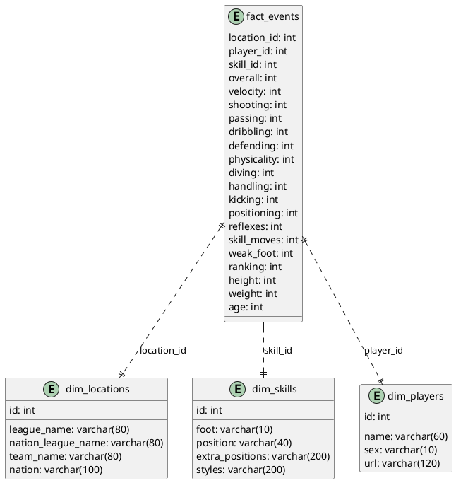

# Base de Datos v1

Diagrama de Base de Datos



# Base de Datos v2

Diagrama de Base de Datos



# Base de Datos v3

Diagrama de Base de Datos



# Diagrama de Secuencia

```plantuml
@startuml
actor Usuario
participant "SvelteApp" as FR
participant "Python Flask" as BE
participant "SQLite DB" as DB1
participant "Mongo DB" as DB2
actor "OpenAI" as OAI

Usuario -> FR : Escribe pregunta
activate FR
Usuario -> FR : Envía pregunta en \n Lenguaje Natural (LN)
FR -> BE : Pregunta LN
activate BE

group Crear Contexto del Prompt
  BE -> BE : Lee schema.sql
  BE -> BE : Lee inserts.sql
  BE -> BE : Junta pregunta con la \n información de los sql
end

BE -> OAI : Contexto + Pregunta LN

activate OAI  
  OAI -> BE : Consulta SQL
deactivate OAI

activate DB1  
  BE -> DB1 : Ejecutar consulta SQL
  DB1 -> BE : Result Set (RS)
deactivate DB1

activate DB2
  BE -> DB2: Grabar consulta + RS
  DB2 -> BE : ObjetcId
deactivate DB2

BE -> BE : Genera response

BE --> FR : Devuelve respuesta
deactivate BE
FR --> Usuario : Muestra respuesta
deactivate FR

@enduml